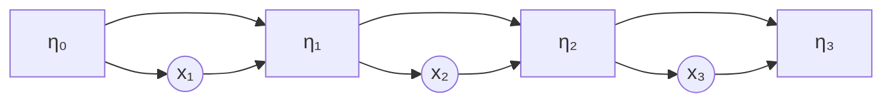
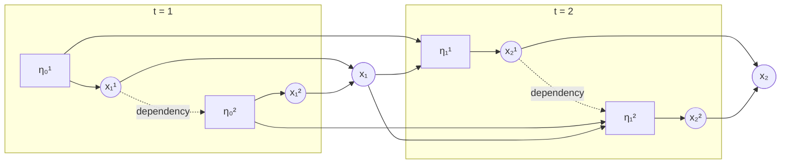
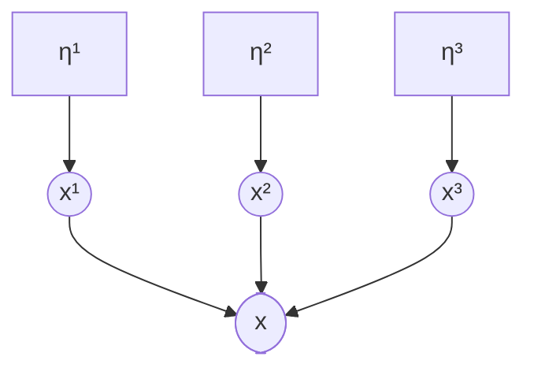
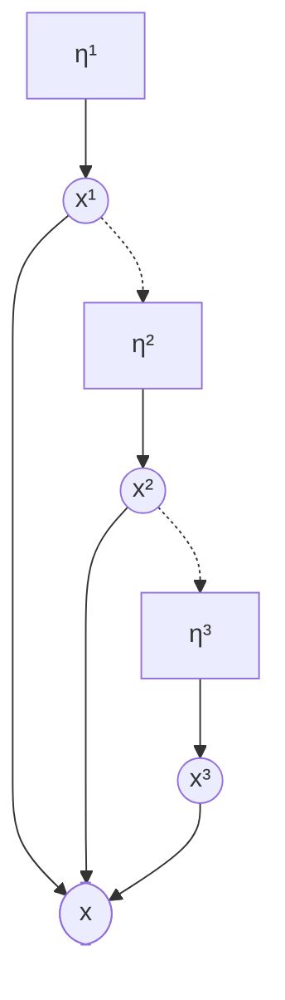
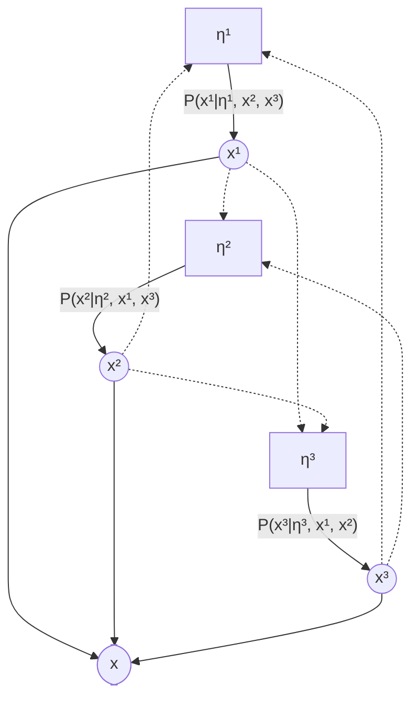

# Generative Processes Specification

**Version:** 1.0  
**Status:** Draft

## 1 Introduction and Notation

### 1.1 Purpose

This document specifies the mathematical objects and observable behaviors that
constitute a *generative process* system. The specification is sufficient for a
ground-up reimplementation in any language or framework. It defines what results
must be obtainable from a generative process.

### 1.2 Scope

The spec covers:

- The definition and construction of generalized hidden Markov models (GHMMs)
- Operations that must be possible on any generative process
- Composition schemes: factored processes, nonergodic mixtures
- Conditional dependency schemes for factored processes
- Conformance test vectors for verifying correctness

The spec does **not** cover:

- Software architecture, programming language, or framework choices
- Algorithms or internal representations
- Implementation-specific conveniences or optimizations

### 1.3 Notation

The following conventions are used within this document. They are not
prescriptions for implementations.

| Symbol | Meaning |
|--------|---------|
| $V$ | Vocabulary size (number of distinct observations) |
| $S$ | State space size (number of hidden states) |
| $x$ | Observation |
| $T^{(x)}$ | Transition matrix for observation $x$ |
| $T$ | Net transition matrix: $T = \sum_x T^{(x)}$ |
| $\mathbf{w}$ | Normalizing eigenvector (right eigenvector of $T$ at eigenvalue 1) |
| $\boldsymbol{\pi}$ | Stationary distribution (left eigenvector of $T$ at eigenvalue 1, normalized to sum to 1) |
| $\boldsymbol{\eta}$ | Belief state (row vector of dimension $S$) |
| $\boldsymbol{\eta}_0$ | Initial belief state |
| $K$ | Number of transition matrix variants (factored processes) |
| $F$ | Number of factors in a factored process |
| $C$ | Number of components in a nonergodic mixture |

**Conventions:**

- All indices are **1-based** throughout the spec: observations in $\{1, \ldots, V\}$, states in $\{1, \ldots, S\}$, factors in $\{1, \ldots, F\}$, variants in $\{1, \ldots, K\}$. The initial belief state $\boldsymbol{\eta}_0$ is the one exception (time 0, before any observations).
- **Subscripts** denote time: $\boldsymbol{\eta}_t$ is the belief state at time $t$, $x_t$ is the observation at time $t$.
- **Superscripts** denote factor index in a factored process: $\boldsymbol{\eta}^i$ is the belief state of factor $i$, $x^i$ is the observation of factor $i$.
- Belief states are **row vectors**. State transitions act by right-multiplying the belief state by a transition matrix: $\boldsymbol{\eta}' = \boldsymbol{\eta}\, T^{(x)}$.
- Transition matrices $T^{(x)}$ have shape $[V, S, S]$, where $T^{(x)}[v]$ is the $S \times S$ matrix applied when observation $v$ is emitted.
- Input transition matrices are provided in **row-vector convention**: the $(i,j)$ entry of $T^{(x)}[v]$ is the unnormalized weight for transitioning from state $i$ to state $j$ while emitting observation $v$. Implementations may transform internally as needed.

## 2 Operations

Given a generative process (base GHMM or composite), it must be *possible* to
obtain the following results. The spec defines what results are required, not
how they are organized or computed.

### 2.1 Observation probability distribution

Given a belief state $\boldsymbol{\eta}$, compute the probability distribution over observations:

$$P(x \mid \boldsymbol{\eta}) \quad \forall\, x \in \{1, \ldots, V\}$$

The result is a vector of dimension $V$ that sums to 1.

### 2.2 Observation sampling

Given a probability distribution over observations (a vector of dimension $V$
summing to 1), sample an observation. This is standard categorical sampling and
is not specific to generative processes.

### 2.3 Belief state update

Given a prior belief state $\boldsymbol{\eta}_{t-1}$ and an observed token $x_t$, compute the posterior belief state $\boldsymbol{\eta}_t$. This is Bayesian filtering: the belief state after conditioning on the observation.

### 2.4 Sequence probability

Given an observation sequence $x_1, \ldots, x_T$, compute the probability $P(x_1, \ldots, x_T)$ under the process's initial state.

### 2.5 Stationary distribution

When it exists and is unique, compute the stationary distribution $\boldsymbol{\pi}$ of the process. Each process type defines when and how $\boldsymbol{\pi}$ exists (§3.8, §4.7, §5.7).

## 3 Generalized Hidden Markov Model

A GHMM generates a sequence of observations by repeatedly sampling from a state-dependent distribution and updating the state:



At each step, $\boldsymbol{\eta}_{t-1}$ determines a distribution over observations and an observation $x_t$ is sampled. Both $\boldsymbol{\eta}_{t-1}$ and $x_t$ determine the next state $\boldsymbol{\eta}_t$.

### 3.1 Authoritative inputs

A GHMM is defined by its **transition matrices** $T^{(x)}$ of shape $[V, S, S]$ in row-vector convention. Everything else is derived.

An **initial state** $\boldsymbol{\eta}_0$ of dimension $S$ may optionally be provided for operations that require one (e.g., sequence probability, generation). When omitted, $\boldsymbol{\eta}_0$ defaults to the stationary distribution $\boldsymbol{\pi}$.

### 3.2 Validity

The transition matrices $T^{(x)}$ must satisfy:

1. All entries must be finite.
2. The net transition matrix $T = \sum_x T^{(x)}$ must have principal eigenvalue 1. If $T$ has no positive real principal eigenvalue, the input is invalid.

*Note:* If the net transition matrix has a positive real principal eigenvalue $\lambda_1 \neq 1$, the matrices can be normalized by dividing each $T^{(x)}$ by $\lambda_1$. This does not change the process's observable behavior.

#### 3.2.1 Hidden Markov Model

A subclass of GHMMs are HMMs which have the additional constraints:

1. All entries must be non-negative
2. For each state $s$, the sum over all observations and next-states must equal 1:

$$\sum_{x, s'} T^{(x)}[s, s'] = 1 \quad \forall\, s$$

They also have the property that the normalizing eigenvector is the all-ones vector: $\mathbf{w} = \mathbf{1}$ (a vector of $S$ ones).

### 3.3 Derived quantities

From the net transition matrix $T$:

- **Normalizing eigenvector $\mathbf{w}$**: the right eigenvector of $T$ at eigenvalue 1, scaled so that the entries sum to $S$:

$$T\,\mathbf{w} = \mathbf{w}, \qquad \sum_i w_i = S$$

- **Stationary distribution $\boldsymbol{\pi}$**: the left eigenvector of $T$ at eigenvalue 1, normalized to a probability distribution:

$$\boldsymbol{\pi}\,T = \boldsymbol{\pi}, \qquad \sum_i \pi_i = 1$$

### 3.4 Observation probability distribution

Given a belief state $\boldsymbol{\eta}$:

$$P(x \mid \boldsymbol{\eta}) = \frac{\boldsymbol{\eta}\,T^{(x)}\,\mathbf{w}}{\boldsymbol{\eta} \cdot \mathbf{w}}$$

where $\boldsymbol{\eta}\,T^{(x)}$ is the row vector resulting from right-multiplying $\boldsymbol{\eta}$ by the $S \times S$ matrix $T^{(x)}$, then dotted with $\mathbf{w}$.

### 3.5 Belief state update

Given a belief state $\boldsymbol{\eta}$ and an observed token $x$:

$$\boldsymbol{\eta}' = \frac{\boldsymbol{\eta}\,T^{(x)}}{\boldsymbol{\eta}\,T^{(x)} \cdot \mathbf{w}}$$

The numerator is the row vector $\boldsymbol{\eta}\,T^{(x)}$. The denominator is the scalar dot product of that vector with $\mathbf{w}$.

**Zero-denominator case:** When $\boldsymbol{\eta}\,T^{(x)} \cdot \mathbf{w} = 0$ (the observation is impossible given the current belief), the update is undefined. This arises only from invalid use (observing a token with zero probability) or numerical issues, not from valid generative process operation. The spec does not prescribe a specific behavior for this case.

*Note on edge case philosophy:* The zero-denominator case in a base GHMM represents a logical error (conditioning on an impossible event), which is why no fallback is prescribed. By contrast, the nonergodic mixture (§5.4) and fully conditional (§4.6.3) prescribe specific fallback behaviors because zero-mass situations can arise naturally in those contexts — a mixture component may not cover all tokens, and the product-of-conditionals approximation may produce degenerate results.

### 3.6 Sequence probability

Given an observation sequence $x_1, \ldots, x_T$ and an initial state $\boldsymbol{\eta}_0$:

$$P(x_1, \ldots, x_T) = \frac{\boldsymbol{\eta}_0\,T^{(x_1)}\,T^{(x_2)} \cdots T^{(x_T)}\,\mathbf{w}}{\boldsymbol{\eta}_0 \cdot \mathbf{w}}$$

The numerator is the scalar obtained by left-multiplying $\boldsymbol{\eta}_0$ through the sequence of matrices and then dotting with $\mathbf{w}$. The denominator is the scalar $\boldsymbol{\eta}_0 \cdot \mathbf{w}$.

### 3.7 Normalizing constant

The value $\boldsymbol{\eta}_0 \cdot \mathbf{w}$ appears as the denominator in §3.4, §3.5, and §3.6. This value depends on the initial state and the normalizing eigenvector. It is not guaranteed to equal 1 under the scaling convention $\sum_i w_i = S$; in general, $\boldsymbol{\pi} \cdot \mathbf{w} \neq 1$.

### 3.8 Stationary distribution

$\boldsymbol{\pi}$ is the left eigenvector of $T$ at eigenvalue 1, normalized to sum to 1:

$$\boldsymbol{\pi}\,T = \boldsymbol{\pi}, \qquad \sum_i \pi_i = 1$$

This always exists for a valid GHMM (by construction, $T$ has eigenvalue 1). It is the invariant belief state — the state that is unchanged by the expected state update — and serves as the default initial state when none is specified (§3.1).

## 4 Composition: Factored Processes

A factored process composes $F$ component generative processes into a single generative process over a composite observation space. Each component runs its own generation process (§3); the factored process specifies how they are coupled.

At each time step, every factor emits an observation and updates its state. The per-factor observations are encoded into a single composite token (§4.3.2). Conditional dependencies between factors (§4.6) determine how one factor's emission can influence another's distribution within the same time step:



The structure of a factored process is a directed graph:

- **Nodes** are the component processes — each a fully-defined generative process.
- **Edges** represent conditional dependencies — how one factor's observation influences another's behavior within the same time step.

### 4.1 Authoritative inputs

- **$F$ component processes** (nodes), each a fully-defined generative process with vocabulary size $V_i$
- **Conditional dependencies** (edges) between factors, specifying the graph topology and $\sigma_i$ functions (§4.6)

### 4.2 Validity

The dependency graph must be a **directed acyclic graph** (DAG). This ensures the joint observation distribution can be computed exactly by evaluating factors in topological order.

**Indexing convention:** Without loss of generality, factors are numbered $1, \ldots, F$ according to a topological sort of the dependency graph. Factor $i$ may only depend on factors $j < i$. This means that at each time step, factors can be evaluated in index order: factor 1 first (no dependencies), then factor 2 (may depend on $x^1$), and so on.

*Note:* Cyclic dependency structures (where every factor depends on every other) do not admit exact joint computation. An approximation scheme for this case is described in §4.6.3, but such structures do not satisfy the DAG validity requirement — they are a pragmatic extension, not a well-formed factored process.

### 4.3 Observation probability distribution

The observation distribution of a factored process is a joint distribution over composite tokens, assembled from the per-factor observation distributions.

#### 4.3.1 Per-factor observation distribution

Each factor $i$ is a generative process that produces an observation distribution $P(x^i \mid \boldsymbol{\eta}^i)$. When factor $i$ has incoming dependency edges (§4.6), its distribution is conditioned on the observations of those specific dependencies within the same time step.

Let $\text{deps}(i) \subseteq \{1, \ldots, i{-}1\}$ be the set of factors that factor $i$ depends on (its parents in the DAG). A conditioned factor requires:

- **$K_i$ transition matrix variants** $T_{i \mid k}^{(x^i)}$ for $k \in \{1, \ldots, K_i\}$, each of shape $[V_i, S_i, S_i]$. The normalizing eigenvector $\mathbf{w}_{i \mid k}$ is derived from $\sum_{x^i} T_{i \mid k}^{(x^i)}$ following §3.3.
- **A total function** $\sigma_i : \prod_{j \in \text{deps}(i)} \{1, \ldots, V_j\} \to \{1, \ldots, K_i\}$ mapping the observations of factor $i$'s dependencies to a variant index.

When $\text{deps}(i) = \emptyset$, $K_i = 1$ and $\sigma_i$ is the constant function.

Given $k = \sigma_i(\{x^j : j \in \text{deps}(i)\})$, the per-factor observation distribution for a GHMM factor:

$$P(x^i \mid \boldsymbol{\eta}^i, k) = \frac{\boldsymbol{\eta}^i\,T_{i \mid k}^{(x^i)}\,\mathbf{w}_{i \mid k}}{\boldsymbol{\eta}^i \cdot \mathbf{w}_{i \mid k}}$$

The concrete topologies in §4.6 specify $\sigma_i$ for each scheme. The conformance tests encode $\sigma_i$ as an explicit lookup table (called a "control map"), but this is one encoding of the function, not the function itself.

#### 4.3.2 Composite token encoding

The factored process produces a composite observation that encodes the joint observation of all factors. The composite vocabulary size is at most the product of the component vocabulary sizes:

$$V_{\text{composite}} \leq V_1 \times V_2 \times \cdots \times V_F$$

Conditional dependencies may make some combinations of component observations impossible (zero probability under all states), in which case the effective vocabulary is smaller than the full product.

The encoding must be a **bijection** between reachable tuples of per-factor observations $(x^1, \ldots, x^F)$ and composite observations. Dense coverage (composite observations in $\{1, \ldots, V_{\text{composite}}\}$ with no gaps) is desirable but not required. Tighter encodings that exclude impossible combinations are valid.

#### 4.3.3 Radix encoding

When $V_{\text{composite}} = V_1 \times \cdots \times V_F$ (the full product space, including unreachable combinations), a mixed-radix (big-endian) scheme provides both a bijection and dense coverage:

**Encoding** (per-factor observations to composite observation):

Given per-factor observations $(x^1, x^2, \ldots, x^F)$ where $x^i \in \{1, \ldots, V_i\}$:

$$x = \sum_{i=1}^{F} (x^i - 1) \cdot m_i + 1$$

where the radix multipliers are:

$$m_i = \prod_{j=i+1}^{F} V_j$$

That is, $m_1 = V_2 \cdot V_3 \cdots V_F$, $m_2 = V_3 \cdots V_F$, ..., $m_F = 1$.

**Decoding** (composite observation to per-factor observations):

Given a composite observation $x$:

$$x^i = \lfloor (x - 1) / m_i \rfloor \bmod V_i + 1$$

**Invariant:** Encoding then decoding (and vice versa) is the identity:

$$\text{decode}(\text{encode}(x^1, \ldots, x^F)) = (x^1, \ldots, x^F)$$

#### 4.3.4 Joint distribution

The joint distribution over composite tokens is assembled from per-factor distributions according to the conditional dependency structure (§4.6). For DAG topologies, the joint is computed exactly by evaluating factors in topological order. For cyclic dependencies, an approximation is used (§4.6.3). In both cases, the result is a distribution of dimension $V_{\text{composite}}$.

### 4.4 Belief state update

Given a composite observation $x_t$ corresponding to per-factor observations $(x^1_t, \ldots, x^F_t)$, the updated state of each factor $i$ is the result of applying factor $i$'s belief state update (§3.5 for GHMM factors) to observation $x^i_t$ under the variant $k = \sigma_i(\{x^j_t : j \in \text{deps}(i)\})$.

### 4.5 Sequence probability

Given a composite observation sequence $x_1, \ldots, x_T$ and initial per-factor states $(\boldsymbol{\eta}_0^1, \ldots, \boldsymbol{\eta}_0^F)$:

$$P(x_1, \ldots, x_T) = \prod_{t=1}^{T} P_{\text{joint}}(x_t \mid \boldsymbol{\eta}^1_{t-1}, \ldots, \boldsymbol{\eta}^F_{t-1})$$

where $P_{\text{joint}}$ is the joint observation distribution (§4.3.4) and each $\boldsymbol{\eta}^i_t$ is obtained from $\boldsymbol{\eta}^i_{t-1}$ via the per-factor state update (§4.4) conditioned on $x_t$. This must go through the joint distribution (not per-factor probabilities independently), because factors may be conditionally dependent.

### 4.6 Conditional dependencies

An edge from factor $j$ to factor $i$ means that factor $i$'s behavior is influenced by factor $j$'s emitted observation. The total function $\sigma_i$ (§4.3.1) selects which transition matrix variant governs factor $i$ — since a GHMM's transition matrix determines both its observation distribution and its state update, a single $\sigma_i$ per factor is sufficient.

> **Open question:** Some existing implementations use separate mappings for observation distribution conditioning and state update conditioning (e.g., observations follow a sequential chain while state updates are fully conditional). We believe these can always be refactored into a single $\sigma_i$ with a suitably constructed set of transition matrix variants — for HMMs this holds because variants can share row sums (same observation probabilities) while differing in next-state distributions. For GHMMs with $\mathbf{w} \neq \mathbf{1}$ the argument is less obvious. This has not been rigorously proven, and there may be cases where the split is genuinely irreducible. The conformance tests (§7) encode the split representation where it appears in the reference implementation.

#### 4.6.1 Graph topologies

The graph topology determines the overall dependency structure among factors. Different topologies have different computational properties.

##### 4.6.1.1 Independent (no edges)

No factor depends on any other. Each factor emits independently and their observations are combined into a composite token.



*Joint distribution:*

$$P(x^1, \ldots, x^F) = \prod_{i=1}^{F} P(x^i \mid \boldsymbol{\eta}^i)$$

The joint is the product of marginals. In the discrete variant realization: $k_i = 1$ for all $i$; $K_i = 1$.

*Required parameters:* None.

##### 4.6.1.2 Sequential chain (linear DAG)

Factor $i$'s distribution depends on factor $(i{-}1)$'s observation. Factor 1 has no dependencies.



*Joint distribution:*

$$P(x^1, \ldots, x^F) = P(x^1 \mid \boldsymbol{\eta}^1) \cdot \prod_{i=2}^{F} P(x^i \mid \boldsymbol{\eta}^i,\, \sigma_i(x^{i-1}))$$

Factor 1 has no parent ($\text{deps}(1) = \emptyset$). Each subsequent factor has $\text{deps}(i) = \{i{-}1\}$, so $\sigma_i : \{1, \ldots, V_{i-1}\} \to \{1, \ldots, K_i\}$.

##### 4.6.1.3 Other DAG topologies

The independent and sequential chain topologies are the two defined in this spec. Other acyclic topologies are possible (e.g., tree-structured dependencies, skip connections). The same principles apply: edges carry conditioning relationships, and the joint distribution factors according to the DAG structure with exact computation at each node.

#### 4.6.2 Variant constraints

For all DAG topologies, $K_i$ must be at least as large as the range of $\sigma_i$: every value that $\sigma_i$ can produce must index a valid variant. When $\text{deps}(i) = \emptyset$, $K_i = 1$.

#### 4.6.3 Approximating fully conditional dependencies

The topologies above are all directed acyclic graphs, where the joint distribution can be computed exactly by evaluating factors in topological order. When every factor depends on every other factor's token, the dependency graph is **cyclic** — there is no topological ordering and no closed-form joint distribution.



Each factor's distribution depends on all other factors' observations — a circular dependency with no evaluation order. The true joint is not available in closed form.

**Product-of-conditionals approximation.** The tractable approximation computes each factor's conditional distribution independently, then normalizes their product. Here $\text{deps}(i) = \{1, \ldots, F\} \setminus \{i\}$ for all $i$, so each $\sigma_i$ maps the observations of all other factors to a variant index.

$$P_{\text{unnorm}}(x^1, \ldots, x^F) = \prod_{i=1}^{F} P\!\left(x^i \mid \boldsymbol{\eta}^i,\, \sigma_i(\{x^j : j \neq i\})\right)$$

$$P(x^1, \ldots, x^F) = \frac{P_{\text{unnorm}}(x^1, \ldots, x^F)}{Z}$$

where $Z = \sum_{\mathbf{x}} P_{\text{unnorm}}(\mathbf{x})$.

**Zero-mass fallback.** If $Z = 0$ (all conditional products are zero), the joint distribution falls back to uniform:

$$P(x^1, \ldots, x^F) = \frac{1}{V_{\text{composite}}}$$

*Note (non-normative):* Implementations may compute the product and normalization in log-space to avoid underflow. In that case, $Z = 0$ corresponds to $\text{logsumexp}(\log P_{\text{unnorm}})$ being negative infinity.

#### 4.6.4 Hybrid conditioning in the reference implementation

The reference implementation includes a scheme where emissions and transitions use different $\sigma$ functions (e.g., sequential emissions with fully-conditional transitions). The conformance tests (§7) encode this as separate `emission_control_maps` and `control_maps_transition` fields. Per the open question in §4.6, we expect this to be expressible as a single $\sigma_i$ with an appropriate set of variants, but the conformance tests preserve the split representation.

### 4.7 Stationary distribution

For independently composed factors ($\text{deps}(i) = \emptyset$ for all $i$), the composite stationary distribution is the tuple of per-factor stationary distributions:

$$\boldsymbol{\pi}_{\text{composite}} = (\boldsymbol{\pi}^1, \boldsymbol{\pi}^2, \ldots, \boldsymbol{\pi}^F)$$

where each $\boldsymbol{\pi}^i$ is the stationary distribution of factor $i$ considered in isolation (using variant 1).

For factored processes with non-trivial conditional dependencies, the stationary distribution may or may not exist depending on the specific coupling. The spec does not define a general method for computing it.

## 5 Composition: Nonergodic Mixture

A nonergodic mixture combines $C$ component processes (each a fully-defined generative process) into a single generative process with Bayesian component tracking.

### 5.1 Authoritative inputs

- **Component processes**: $C$ generative processes, each independently defined (may be base GHMMs, factored processes, or other composites). Component $i$ has local vocabulary size $V_i$.
- **Component weights** $\mathbf{w}_{\text{mix}} \in \mathbb{R}^C$, normalized to sum to 1.
- **Vocabulary mappings**: for each component $i$, an injective function $\phi_i : \{1, \ldots, V_i\} \to \{1, \ldots, V_{\text{global}}\}$ from local to global token indices. The images $\phi_i(\{1, \ldots, V_i\})$ may overlap across components (multiple components can emit the same global token). The global vocabulary size is $V_{\text{global}} = \max_i(\max(\phi_i))$. Since $\phi_i$ is injective, the inverse $\phi_i^{-1}$ is well-defined on the image of $\phi_i$: given a global token $x$, $\phi_i^{-1}(x)$ is the corresponding local token if $x \in \phi_i(\{1, \ldots, V_i\})$, and undefined otherwise.

### 5.2 State structure

The state of a nonergodic mixture consists of:

- **Component beliefs** $\boldsymbol{\beta} \in \mathbb{R}^C$ with $\sum_i \beta_i = 1$, representing $P(\text{component}\; i \mid \text{observations so far})$.
- **Per-component states** $(\boldsymbol{\eta}^1, \ldots, \boldsymbol{\eta}^C)$, one per component process.

### 5.3 Observation probability distribution

$$P(x \mid \boldsymbol{\beta}, \boldsymbol{\eta}^1, \ldots, \boldsymbol{\eta}^C) = \sum_{i=1}^{C} \beta_i \cdot P_i(\phi_i^{-1}(x))$$

If $\phi_i^{-1}(x)$ is undefined (the global token is not in component $i$'s vocabulary), component $i$'s contribution is 0.

### 5.4 Belief state update

Given a global observation $x$, define the per-component likelihood:

$$\ell_i = \begin{cases} P_i(\phi_i^{-1}(x)) & \text{if } x \in S_i \\ 0 & \text{otherwise} \end{cases}$$

The component beliefs update via Bayes rule:

$$\beta_i' = \frac{\beta_i \cdot \ell_i}{\sum_j \beta_j \cdot \ell_j}$$

Each component's internal state updates only when the observation is in that component's vocabulary:

$$\boldsymbol{\eta}^{i\prime} = \begin{cases} \dfrac{\boldsymbol{\eta}^i\,T_i^{(\phi_i^{-1}(x))}}{\boldsymbol{\eta}^i\,T_i^{(\phi_i^{-1}(x))} \cdot \mathbf{w}_i} & \text{if } \ell_i > 0 \\[6pt] \boldsymbol{\eta}^i & \text{otherwise} \end{cases}$$

**Zero-likelihood fallback:** When $\sum_j \beta_j \cdot \ell_j = 0$ (the observation has zero likelihood under every component), both $\boldsymbol{\beta}$ and all $\boldsymbol{\eta}^i$ revert to their prior values. This prevents division-by-zero.

### 5.5 Sequence probability

$$P(x_1, \ldots, x_T) = \sum_{i=1}^{C} w_{\text{mix},i} \cdot P_i(\phi_i^{-1}(x_1), \ldots, \phi_i^{-1}(x_T))$$

If any $x_t \notin S_i$, component $i$'s contribution is 0.

### 5.6 Generation

Generation samples a single component $i$ from $\boldsymbol{\beta}$, generates the entire sequence from component $i$'s process, and maps each local observation through $\phi_i$ to produce global observations. There is no switching between components mid-sequence.

### 5.7 Stationary distribution

A nonergodic mixture does not have a unique stationary distribution. Each component has its own, but there is no single distribution that is invariant for the mixture as a whole. The initial state is the component weights $\mathbf{w}_{\text{mix}}$ plus the per-component initial states.

## 6 Addendum: Sequence Generation

The preceding sections define the mathematical objects and their properties. This section specifies additional requirements for generating sequences from these processes — for training, analysis, and visualization. These requirements do not alter any process definition — they concern how generated sequences are augmented and delivered for downstream consumption.

### 6.1 Sequence generation

Given a generative process and an initial state, generate a sequence of $n$ observations by repeatedly sampling from the observation distribution and updating the belief state.

### 6.2 Sequence augmentation

Raw generated sequences may be augmented with framing tokens:

- **BOS** (beginning-of-sequence): prepended before the first body token
- **EOS** (end-of-sequence): appended after the last body token
- **PAD** (padding): fills remaining positions to reach a target length

BOS, EOS, and PAD token indices must be outside the process's vocabulary range $\{1, \ldots, V\}$. They are framing tokens, not process observations, and do not participate in belief state updates.

When all augmentations are applied, the output layout is:

$$[\text{BOS},\, \text{body}_1, \ldots, \text{body}_n,\, \text{EOS},\, \text{PAD}, \ldots, \text{PAD}]$$

padded to total length $L \geq n + 2$. There is no early termination — the process always runs for $n$ steps. PAD is only relevant when $L > n + 2$.

### 6.3 Batched generation

Sequences must be producible in batches: a collection of sequences generated from prescribed initial states, all of the same total length $L$.

### 6.4 Device and interoperability

Generated batches must be usable on both CPU and NVIDIA GPUs (CUDA). Implementations must support [DLPack](https://dmlc.github.io/dlpack/latest/) so that output tensors can be consumed by other frameworks without copying — for example, `torch.from_dlpack(output)` to train PyTorch models. This allows the generation implementation to use any framework internally as long as it exposes DLPack-compatible output.

## 7 Conformance Test Vectors

### 7.1 Encoding scheme

**Index convention note:** Conformance test JSON uses 0-based array indexing as is standard for JSON and programming languages, while the spec's mathematical notation uses 1-based indexing. The first element of a JSON array corresponds to index 1 in the spec.

#### 7.1.1 Process definitions

Process definitions are encoded as JSON objects with a `type` discriminator:

**Base GHMM:**

```json
{
  "type": "ghmm",
  "transition_matrices": [[[...]]]
}
```

`transition_matrices` is a 3D array of shape $[V, S, S]$. An optional `initial_state` field (1D array of dimension $S$) overrides the default stationary distribution.

**HMM** (a GHMM with $\mathbf{w} = \mathbf{1}$):

```json
{
  "type": "hmm",
  "transition_matrices": [[[...]]]
}
```

The `hmm` type tag is a convenience for conformance testing, indicating that the additional validity constraints of §3.2.1 apply (non-negative entries, rows of $T$ sum to 1). Mathematically, an HMM is a GHMM where $\mathbf{w} = \mathbf{1}$; the separate type tag signals which validation rules to check, not a distinct mathematical object.

**Factored process:**

```json
{
  "type": "factored",
  "factors": [
    {
      "component_type": "hmm",
      "transition_matrices": [[[[...]]]],
      "initial_state": [...],
      "vocab_size": 2
    }
  ],
  "structure": {
    "type": "independent"
  }
}
```

`transition_matrices` is a 4D array of shape $[K, V, S, S]$. The `structure` object specifies the conditional dependency scheme with its parameters.

**Nonergodic mixture:**

```json
{
  "type": "nonergodic",
  "components": [...],
  "weights": [...],
  "vocab_maps": [[...], ...]
}
```

#### 7.1.2 State encoding

- **GHMM state:** a 1D array of dimension $S$
- **Factored state:** an ordered list of 1D arrays, one per factor
- **Nonergodic state:** an object with `component_beliefs` (1D array of dimension $C$) and `component_states` (list of state encodings, one per component)

#### 7.1.3 Structure definitions

```json
{"type": "independent"}

{"type": "sequential", "control_maps": [null, [0, 1, ...]]}

{"type": "fully_conditional", "control_maps": [[...], [...]]}

{"type": "conditional_transitions",
 "control_maps_transition": [[...], [...]],
 "emission_variant_indices": [0, 0],
 "emission_control_maps": [null, [1, 0]]}
```

For `conditional_transitions`, the emission mode is derived from the `emission_control_maps` field: if present and any entry for $i \geq 2$ is non-null, emissions follow a sequential chain; if absent, emissions use fixed `emission_variant_indices`.

**Initial state convention:** When a base process definition in a test vector omits `initial_state`, the default is the stationary distribution (§3.1). Tests in the `ghmm_stationary_distribution` category verify this computation independently and should be validated first, since other test vectors (particularly sequence probability) depend on correct stationary distribution computation.

### 7.2 Tolerance

All numerical comparisons use relative tolerance to accommodate floating-point differences across implementations and platforms. Each test vector specifies its tolerance. A default of $10^{-6}$ relative tolerance is used unless otherwise noted.

### 7.3 Generation tests

Conformance vectors cover only deterministic operations. Sequence generation augmentations (§6) are behaviorally specified (BOS/EOS/PAD layout, token positions) but not numerically tested, because sampling depends on RNG implementation.

### 7.4 Test vectors

Test vectors are provided in the companion file `conformance-tests.json`. Each test vector has these required fields:

- `id`: unique identifier
- `category`: which aspect is being tested
- `description`: human-readable description
- `operation`: which operation is being tested
- `input`: operation-specific input (state, observation sequence, etc.)
- `expected`: expected output (numerical value, array, or object)

And these optional fields:

- `process`: process definition (§7.1.1) — omitted for operation-only tests like token encoding
- `tolerance`: relative tolerance for numerical comparison (defaults to the file-level `default_tolerance` when omitted)
- `notes`: human-readable explanation of the expected value

Categories covered:

1. **ghmm_observation_distribution** — Observation probability distribution from a GHMM belief state
2. **ghmm_belief_update** — Belief state update after observing a token
3. **ghmm_sequence_probability** — Probability of an observation sequence
4. **ghmm_hmm_case** — GHMM with $\mathbf{w} = \mathbf{1}$ (HMM case)
5. **ghmm_nontrivial_w** — GHMM with non-trivial normalizing eigenvector
6. **ghmm_stationary_distribution** — Stationary distribution computation
7. **factored_token_encoding** — Radix token encoding/decoding roundtrip
8. **factored_independent** — Independent factored joint distribution
9. **factored_sequential** — Sequential chain joint distribution
10. **factored_fully_conditional** — Fully conditional joint distribution
11. **factored_conditional_transitions** — Conditional transitions joint distribution
12. **fully_conditional_zero_fallback** — Uniform fallback when all mass is zero
13. **nonergodic_observation_distribution** — Mixture observation distribution
14. **nonergodic_belief_update** — Bayesian component belief update
15. **nonergodic_sequence_probability** — Mixture sequence probability
16. **nonergodic_zero_likelihood** — Zero-likelihood fallback (beliefs revert to prior)
17. **nonergodic_vocab_mapping** — Different vocabulary maps across components
18. **generation_layout** — BOS/EOS/PAD token layout verification

## 8 Glossary

| Term | Definition |
|------|-----------|
| Belief state ($\boldsymbol{\eta}$) | The state of a generative process: a row vector representing the current probability distribution over hidden states, conditioned on observations so far. For composite processes, the state is composed of its components' belief states. |
| BOS | Beginning-of-sequence token; a framing token prepended to generated sequences |
| Component | One of the constituent processes in a nonergodic mixture |
| Composite token | A single integer encoding the joint observation of all factors in a factored process |
| Conditional dependency | A relationship between factors in a factored process, where one factor's observation influences another's behavior via the total function $\sigma_i$ (§4.6) |
| Control map | A lookup-table encoding of $\sigma_i$ used in the conformance tests (§7); maps token indices to variant indices |
| EOS | End-of-sequence token; a framing token appended after the last body token |
| Factor | One of the constituent generative processes in a factored process |
| GHMM | Generalized Hidden Markov Model; the fundamental process type in this spec |
| HMM | Hidden Markov Model; a GHMM where the normalizing eigenvector is the all-ones vector |
| Net transition matrix | $T = \sum_x T^{(x)}$; the sum over all observation-conditional matrices |
| Normalizing eigenvector | The right eigenvector $\mathbf{w}$ of $T$ at eigenvalue 1, used for belief state normalization |
| Observation | A discrete token emitted by the process at each time step |
| PAD | Padding token; fills remaining positions when total length $L > n + 2$ |
| Principal eigenvalue | The largest real eigenvalue of the net transition matrix $T$ |
| Radix encoding | Mixed-radix positional encoding of per-factor tokens into a composite token |
| Spectral normalization | Dividing transition matrices by the principal eigenvalue when it is not already 1 (see §3.2 note) |
| Stationary distribution | The left eigenvector $\boldsymbol{\pi}$ of $T$ at eigenvalue 1, normalized to sum to 1; the invariant belief state |
| Transition matrix | $T^{(x)}$, the $S \times S$ matrix governing state transitions when observation $x$ is emitted |
| Graph topology | The structure of conditional dependencies among factors: acyclic (DAG) topologies permit exact joint computation; cyclic topologies require approximation (§4.6.3) |
| Total function ($\sigma_i$) | A function mapping the observations of factor $i$'s dependencies to a transition matrix variant index (§4.3.1) |
| Variant | One of $K_i$ alternative transition matrices for a factor, selected by $\sigma_i$ |
| Vocabulary mapping ($\phi_i$) | A bijection from a component's local token indices to global token indices in a nonergodic mixture (§5.1) |
