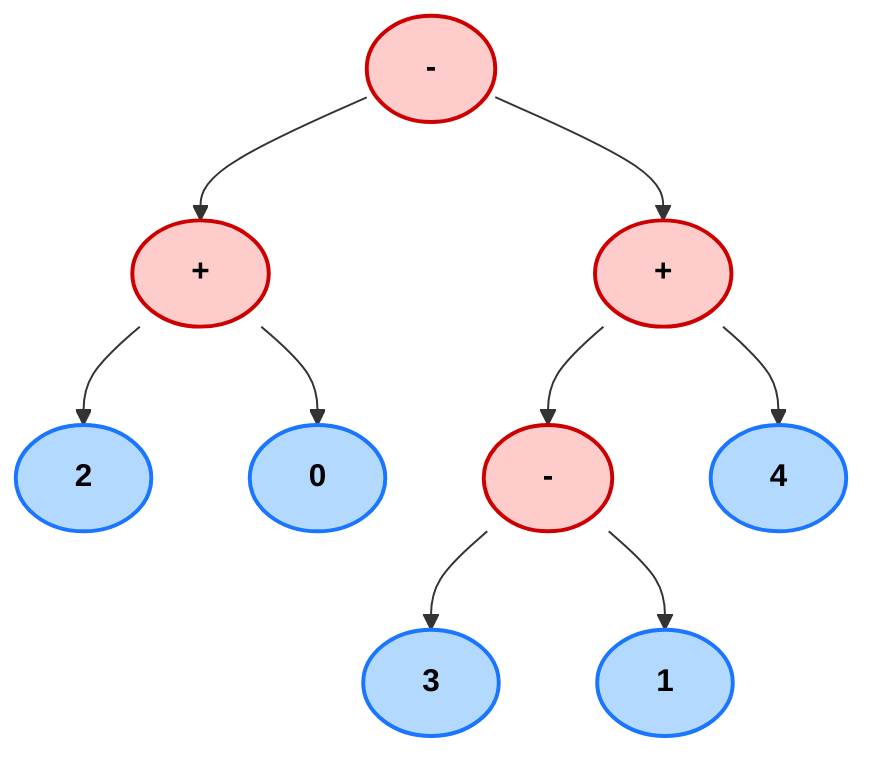

```mermaid
graph TD

node0[#45;]
node1[#43;]
node2[#43;]
node3[2]
node4[0]
node5[#45;]
node6[4]
node11[3]
node12[1]
node0 --> node1
node0 --> node2
node2 --> node5
node1 --> node3
node1 --> node4
node2 --> node6
node5 --> node11
node5 --> node12

classDef operand fill:#b3d9ff,stroke:#1a75ff,stroke-width:2px,color:#000,font-weight:bold,rx:40,ry:40;
classDef operator fill:#ffcccc,stroke:#cc0000,stroke-width:2px,color:#000,font-weight:bold,rx:40,ry:40;

class node0,node1,node2,node5 operator;
class node3,node4,node6,node11,node12 operand;

```
