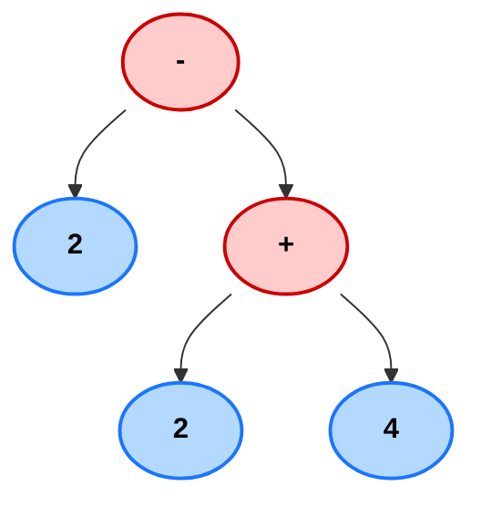

```mermaid
graph TD

node0[#45;]
node1[2]
node2[#43;]
node5[2]
node6[4]
node0 --> node2
node0 --> node1
node2 --> node5
node2 --> node6

classDef operand fill:#b3d9ff,stroke:#1a75ff,stroke-width:2px,color:#000,font-weight:bold,rx:40,ry:40;
classDef operator fill:#ffcccc,stroke:#cc0000,stroke-width:2px,color:#000,font-weight:bold,rx:40,ry:40;

class node0,node2 operator;
class node1,node5,node6 operand;

```
